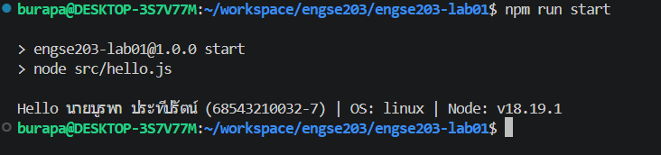

# ENGSE203 LAB 01 — <Developer Environment & GitHub Repository Setup>

## ผู้จัดทำ

- ชื่อ-นามสกุล: นายบูรพา ประทีปรัตน์
- รหัสนักศึกษา: 68543210032-7
- ระบบปฏิบัติการที่ใช้: Windows

## วัตถุประสงค์ของงาน

- ตรวจสอบและใช้ Node.js, npm, Visual Studio Code และ Git จาก Terminal ได้
- สร้างโครงงาน JavaScript ขนาดย่อม พร้อม package.json และ npm script
- รันโปรแกรม Node.js ที่แสดงชื่อ รหัสนักศึกษา OS และ Node.js version ได้
- สร้าง GitHub repository, commit, push และจัดทำ README เพื่อเป็นหลักฐานการเรียนรู้ได้

## เครื่องมือที่ใช้

- Visual Studio Code
- Node.js รุ่น LTS และ npm
- Git
- บัญชี GitHub ที่ใช้งานได้
- อินเทอร์เน็ต

## วิธีติดตั้งและรัน

เปิด Terminal ในโฟลเดอร์โปรเจกต์แล้วรันคำสั่งต่อไปนี้:

```bash
# รัน NodeJS เพื่อแสดงผลลัพธ์
npm install
npm run start
```

## โครงสร้างไฟล์

```text
.
├── src/
    └── hello.js
├── Image_Lab_1.png
├── package.json
└── README.md

```

## หลักฐานผลลัพธ์

เมื่อรันคำสั่ง `npm run start` ระบบจะแสดงชื่อ-นามสกุล รหัสนักศึกษา และเวอร์ชันของระบบปฏิบัติการอย่างถูกต้องใน Terminal ดังนี้:


## ปัญหาที่พบและวิธีแก้ไข

- ปัญหา: พอพิมพ์คำสั่งใน WSL แล้วระบบขึ้นเตือนว่า Command not found (ไม่รู้จักคำสั่ง) เพราะบนฝั่ง Linux ของ WSL ยังไม่มีเครื่องมือเหล่านี้ (มีแต่ฝั่ง Windows)
- วิธีแก้: ทำการติดตั้งเครื่องมือเพิ่มใน WSL โดยพิมพ์คำสั่ง sudo apt update แล้วตามด้วย sudo apt install git (หรือเครื่องมือที่แล็บกำหนด) เพื่อติดตั้งโปรแกรมลงในฝั่ง Linux ให้เรียบร้อยก่อนใช้งาน

## References & AI Assistance

- Source / Documentation: https://github.com/se-rmutl/engse203-lab
- AI tool used: Gemini
- Used for: ช่วยวิเคราะห์สาเหตุของ Error "Command not found" บน WSL และขอคำแนะนำเกี่ยวกับคำสั่งลินุกซ์ในการติดตั้งเครื่องมือให้ถูกต้อง
- My adaptation: นำคำสั่ง `sudo apt update` และ `sudo apt install` ที่ AI แนะนำ มาปรับใช้เพื่อติดตั้ง Package ของโปรแกรมที่ระบบขาดไปจริงในเครื่องของตนเอง จนสามารถรันคำสั่งทำแล็บต่อได้สำเร็จ